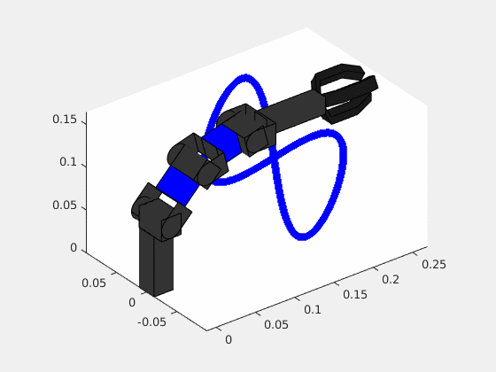

# Course_Robot_Arm_4DOF

## Demostración del Brazo Robot de 4 grados de libertad



## Digital Twin

Demostración del Digital Twin:


## Creación de un Paquete ROS C++

Si deseas crear un paquete ROS C++ para trabajar con el brazo robótico, puedes seguir estos pasos:

1. Crea un nuevo paquete ROS llamado `brazo_robotico` utilizando el comando `catkin_create_pkg` en el direcotrio catkin_ws/src:
    ```bash
    cd ~/catkin_ws/src
    catkin_create_pkg brazo_robotico roscpp std_msgs
    ```

2. Navega al directorio de tu paquete recién creado:
    ```bash
    cd ~/catkin_ws/src/brazo_robotico
    ```

3. Crea un archivo llamado `nodo_robot.cpp` en el directorio `src` del paquete:
    ```bash
    touch src/nodo_robot.cpp
    ```

4. Agrega el siguiente contenido al archivo `src/nodo_robot.cpp`:
    ```cpp
    #include "ros/ros.h"
    #include "std_msgs/String.h"

    int main(int argc, char **argv) {
        ros::init(argc, argv, "nodo_robot");
        ros::NodeHandle nh;
        
        ros::Publisher pub = nh.advertise<std_msgs::String>("chatter", 1000);

        ros::Rate loop_rate(10);

        while (ros::ok()) {
            std_msgs::String msg;
            msg.data = "Hola desde brazo_robotico";

            pub.publish(msg);
            ros::spinOnce();
            loop_rate.sleep();
        }

        return 0;
    }
    ```

5. Modifica el archivo `CMakeLists.txt` en el directorio de tu paquete (`~/catkin_ws/src/brazo_robotico/CMakeLists.txt`) con el siguiente contenido:
    ```cmake
    cmake_minimum_required(VERSION 3.0.2)
    project(brazo_robotico)

    find_package(catkin REQUIRED COMPONENTS
      roscpp
      std_msgs
    )

    catkin_package()

    include_directories(
      ${catkin_INCLUDE_DIRS}
    )

    add_executable(nodo_robot src/nodo_robot.cpp)

    target_link_libraries(nodo_robot
      ${catkin_LIBRARIES}
    )
    # Si deseas agregar más ejecutables, puedes hacerlo por ejemplo como sigue:
    # add_executable(nodo_arm src/nodo_arm.cpp)
    # target_link_libraries(nodo_arm
    #   ${catkin_LIBRARIES}
    # )
    ```

6. Luego, ejecuta `catkin_make` para compilar tu paquete:
    ```bash
    cd ~/catkin_ws
    catkin_make
    ```
7. En el caso de que no se detecte los cambios en el espacio de trabajo, ejecutamos lo siguiente:
    ```bash
    cd ~/catkin_ws
    catkin_make --only-pkg-with-deps brazo_robotico
    ```

Con estos pasos, habrás creado un paquete ROS C++ llamado `brazo_robotico` que incluye dos nodos: `nodo_robot` y `nodo_brazo`.


## Modelo de una Partícula en el Espacio

Este ejemplo muestra un modelo simple de una partícula en el espacio controlada por un nodo ROS en C++. 

```cpp
#include <ros/ros.h>
#include <sensor_msgs/Joy.h>
#include <Eigen/Dense>
#include <iostream>


using namespace Eigen;
using namespace std;

double u1 = 0;
double u2 = 0;
double u3 = 0.0;
double u4 = 0.0;

Eigen::VectorXd u_ref(4);

void control_callback(const sensor_msgs::Joy::ConstPtr& state_msg)
{
    u1 = state_msg->axes[0];
    u2 = state_msg->axes[1];
    u3 = state_msg->axes[2];
    u4 = state_msg->axes[3];

    u_ref << u1, u2, u3, u4;

    // Imprimir el valor de u
    
}

VectorXd get_control_action()
{
    Eigen::VectorXd uf(4);
    uf << u_ref(0), u_ref(1), u_ref(2), u_ref(3);
    //std::cout << "u: " << uf.transpose() << std::endl;
    return uf;
}

void send_arm_states(const VectorXd& q, ros::Publisher& control_pub, sensor_msgs::Joy& control_msg)
{
    control_msg.header.frame_id = "Arm States";
    control_msg.header.stamp = ros::Time::now();
    control_msg.axes.clear();
    for (int i = 0; i < q.size(); ++i)
    {
        control_msg.axes.push_back(q(i));
    }
    control_pub.publish(control_msg);
}

MatrixXd f_sys(const VectorXd& x, const VectorXd& u)
{
    MatrixXd A(4, 4);
    MatrixXd B(4, 4);
    
    A << -0.7706, -0.0051, 0.2265, 0.1806,
         0.0163, -0.3537, -0.2810, 0.0157,
         -0.2056, -0.0701, -1.2446, 0.0927,
         -0.3169, 0.0471, -0.0381, -1.6991;

    B << 0.9636, -0.0825, -0.1494, -0.0196,
         0.0113, 1.0200, -0.0269, -0.0893,
         0.0338, -0.0108, 1.8970, -0.0488,
         0.1425, 0.0266, -0.1410, 2.0500;

    return A * x + B * u;
}


void main_loop(ros::Publisher& control_pub, sensor_msgs::Joy& control_msg)
{
    double t_final = 60;
    double freq = 30;
    double t_s = 1.0 / freq;
    double ros_rate = 30;

    Eigen::VectorXd q(4);
    Eigen::VectorXd q_p(4);
    Eigen::VectorXd u(4);
    
    q << 0, 0, 0, 0; // Initial condition
    u_ref << 0,0,0,0;

    std::cout << "OK, controller is running!!!!" << std::endl;

    ros::Rate rate(ros_rate);

    for (int k = 0; k < t_final * freq; ++k)
    {
        // Llamar a spinOnce para procesar los callbacks
        ros::spinOnce();
        
        // Read Real data
        u =  get_control_action();
        
        //u << 1, 0.5, 1, -0.5;

        // Model ARM [ q_p = f(q,u) ]
        q_p = f_sys(q, u);

        // Evolucion de los estados del sistema
        q = q_p * t_s + q;

        send_arm_states(q, control_pub, control_msg);

        // Imprimir el valor de u
        std::cout << "q: " << q.transpose() << std::endl;

        
        
        // Espera para cumplir con la frecuencia de publicación deseada
        rate.sleep();
    }
}

int main(int argc, char** argv)
{
    ros::init(argc, argv, "Robot");
    ros::NodeHandle nh;

    ros::Subscriber velocity_subscriber = nh.subscribe("/control", 10, control_callback);
    ros::Publisher control_pub = nh.advertise<sensor_msgs::Joy>("/states", 10);
    sensor_msgs::Joy control_msg;

    //u_ref.setZero(); 

    main_loop(control_pub, control_msg);

    return 0;
}


```
